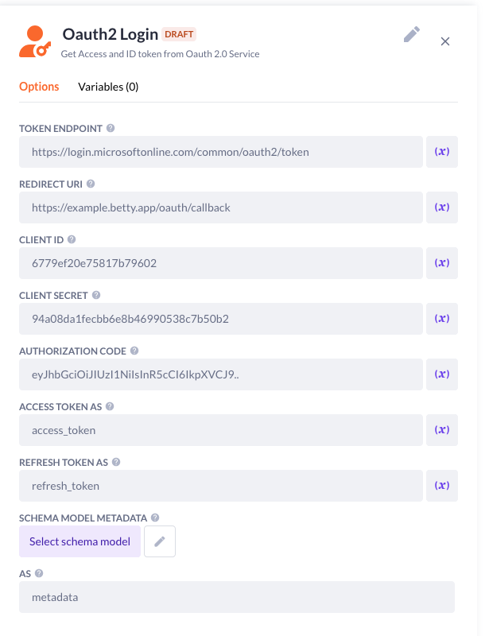

### Summary
This step allows to easily login to OAuth2 with ability for a custom token endpoint

### Inputs
- The inputs are provided by the Oauth provider
- Authorization code is obtained after login the Oath provider will send back

### Prefab (function.json)
